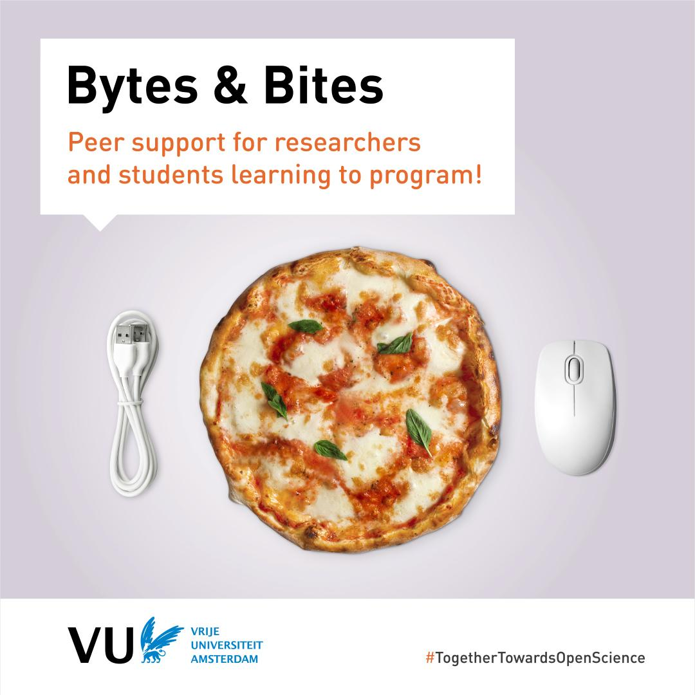
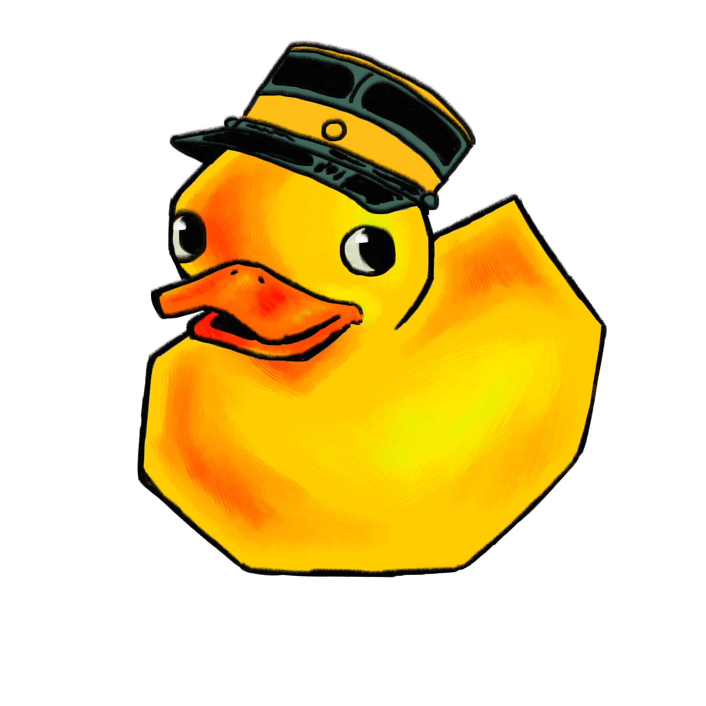
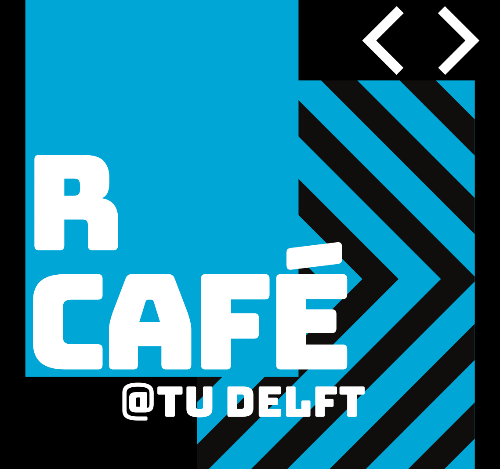
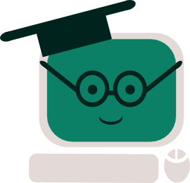
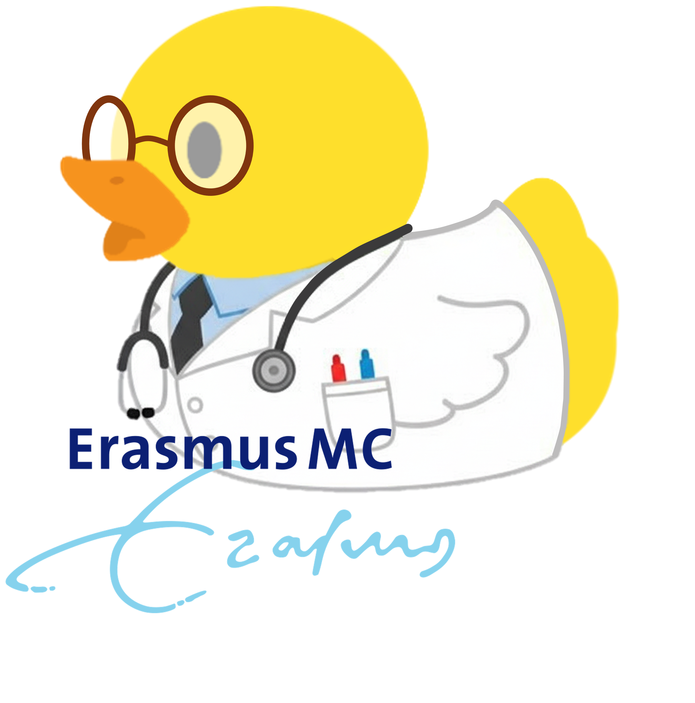
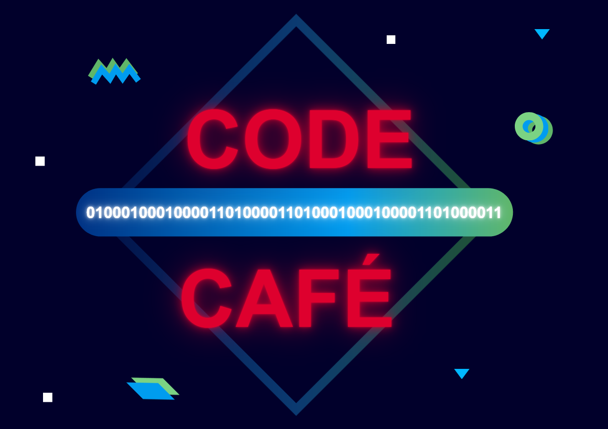
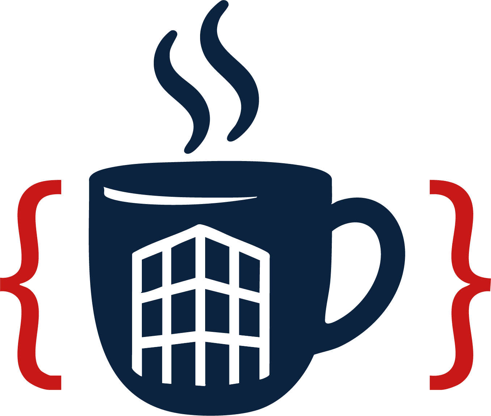

# Overview Cafés {.unnumbered}

Since the Coding Café project began last year, new Cafés have been launched, some gained fresh momentum, and others decided to join this network. This is great news, since it shows that we are not alone!

Find an overview of all participating Cafés here:

::: {layout-ncol=4}
[{height=1.5in}](https://ubvu.github.io/bytes-and-bites/)

[{height=1.5in}](https://www.uu.nl/en/research/research-data-management/workshops/programming-cafe-0)

[{height=1.5in}](https://delft-rcafe.github.io/home/)

[{height=1.5in}](https://eur-nl.github.io/programming-cafe/)

[{height=1.5in}](https://seredef.github.io/EMC-coding-cafe/)

[{height=1.5in}](https://www.rug.nl/digital-competence-centre/calendar/2026/code-cafe-08-05-2026?lang=en)

[{height=1.5in}](https://maastrichtu-library.github.io/programming-on-the-vlaai/)
:::

# Other Cafés

::: {layout-ncol=4}

[{width=1.5in}](https://www.becodingcafe.com)
:::
