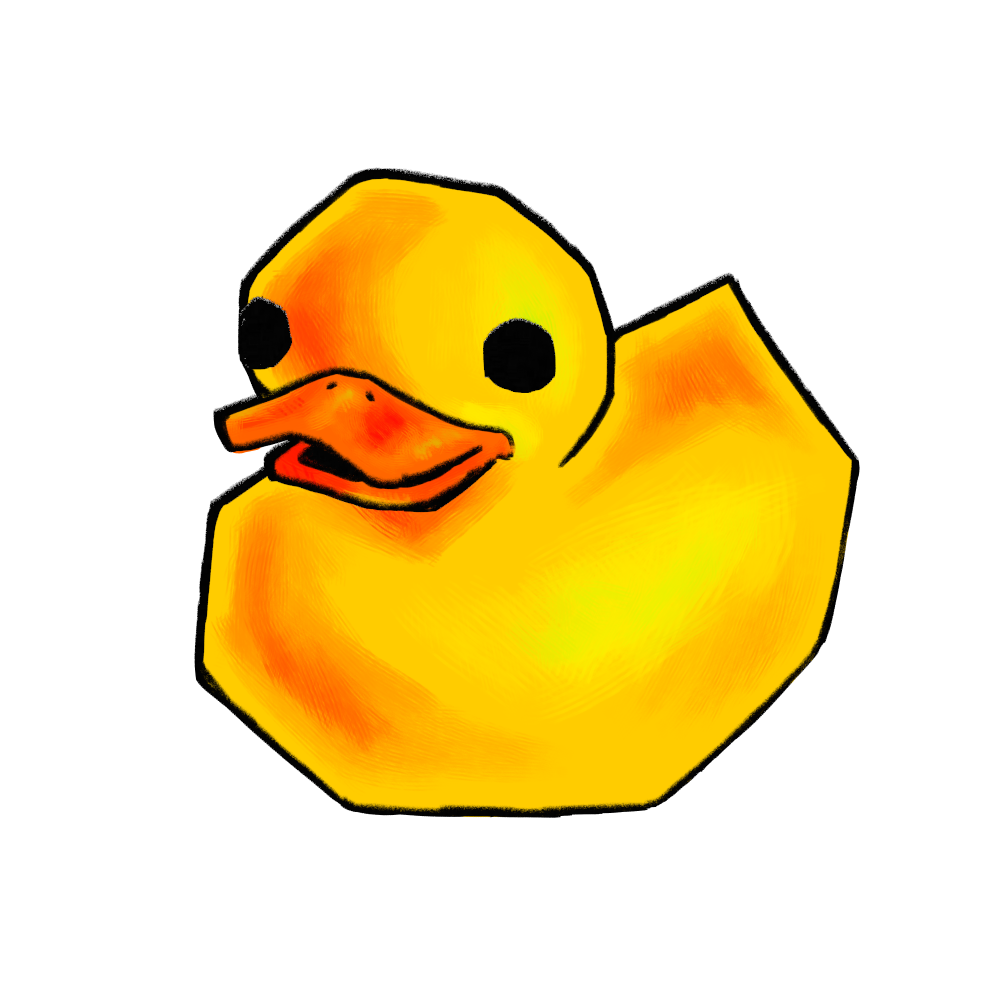

{height=300}

The Coding CAFE project commissioned the creation of a new logo and set of materials for institutes to make their own. [Read how you can make your own]() The art was created by [juulsart](https://juulsart.my.canva.site/), you can find more works by the artist via [@juuls.art](https://www.instagram.com/juuls.art/).

# Why a duck?

There are two reasons that the CAFE project uses the duck as its logo:

    1.  It refers to rubberducking or rubber duck debugging, a form of debugging in the programming world.
    2.  They are cute.

# What is rubber duck debugging?

Think about the last time you were stuck fixing a bug. What did you do? Scoured the code? Searched for the error code? Asked a friend? Did you notice that often you realise the problem before your friend even gets a chance to help? 

When explaining the problem it forces you to walk through the whole logic process of the code. Often there is something you are overlooking due to being too fixated on the problem and when you explain the code and problem you have to state every step. It is usually somewhere in a forgotten step that you need to make your change. Since you don't need an answer you could equally explain the code and problem to a baby, a dog, a tree, or more commonly a rubber duck. Thus rubber duck debugging.

When joining a cafe you will engage in a code walkthrough, see a new tool, learn about [FAIR](https://fair-software.nl/) practices, get a deeper understanding of fundamentals, and talk with other programmers and coding enthusiasts. All of these will provide you with a different view on how to approach problems and in turn new ways for your code to break, but also ways to fix it! 

# How can I make my own logo?

We have provided a guide on how to make your own rubber duck logo. [Check it out here!](make_your_own.qmd)