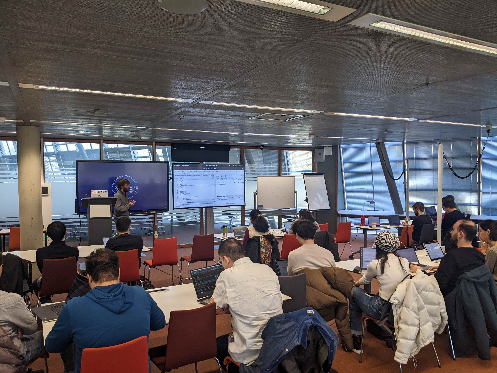
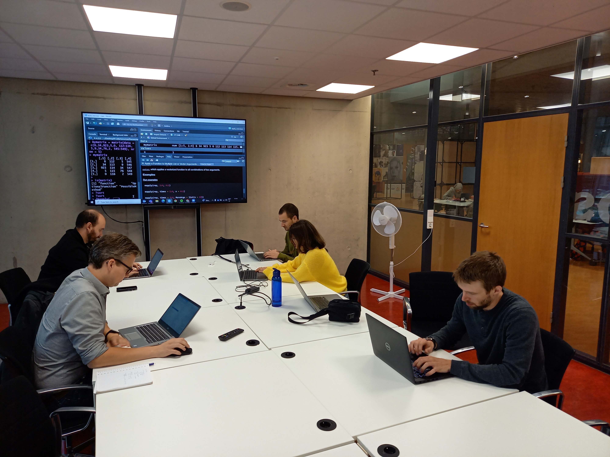

# TU Delft: R Café {.unnumbered}

_Do you want to build your skills in the programming language R, write R code with others, or ask questions about working with R?_

**Website:** [https://delft-rcafe.github.io/home](https://delft-rcafe.github.io/home)

::: {layout-ncol="2"}
{.lightbox group="rcafe-gallery" fig-alt="A picture taken from the back of a classroom. at the front is a person standing in front of two screens. Facing the front are two rows of people sitting at tables with their laptops open."}

{.lightbox group="rcafe-gallery"}
:::

## Who we are

We’re a group of R enthusiasts from across the TU Delft community who meet monthly to discuss questions from the very broad, "Why should I use R?" to the hyper-specific, "Why is my code not working?!" 

Together we make up a supportive community of practice for researchers to share knowledge and learn with each other in an open and informal setting.

Our initiative was started by Ashley Cryan and Aleksandra Wilczynska, inspired by Utrecht University’s Programming Café, and has been running monthly meetings since November 2021.

## Who can join

The R Café is open to anyone who works in R or is interested in learning. No prior experience with R is necessary - all are welcome! Many of our members have recently completed the Data Carpentry workshop and are looking for a space to continue practicing R skills with others. You can also join if you’ve got plenty of R experience and want to share some awesome tips and tricks (e.g., about an R package, type of analysis, or visualization) with others.

## Community meetings

Our monthly meetings usually have a theme which we can touch upon by brief presentations by one or more of our members, exercises for us to work through, a group discussion, or some combination.

We take a hands-on approach to work through problems and always have RStudio open for live coding. Because we know our audience, we offer a unique combination of ☕ and 🍕.

## More information? 

The R Cafe is an initiative of the TU Delft Library Research Data Services Team and the Digital Competence Centre. The organizers are Aleksandra Wilczynska and Bjorn Bartholdy. For questions or more information, please contact rcafe-lib [at] tudelft.nl. You can also find us on [GitHub](https://github.com/Delft-RCafe/) and via our [website](https://delft-rcafe.github.io/home).

